<div align="center">

<!-- HERO HEADER -->


<!-- TYPING SVG -->
[](https://git.io/typing-svg)

<br>

<a href="mailto:krishbaveja07@gmail.com"></a>&nbsp;
<a href="https://www.linkedin.com/in/krish-baveja" target="_blank"></a>&nbsp;


</div>

<!-- ════════════════════════════════════════════════════════ -->

## About Me

```typescript
const krish = {
    location:  "Delhi, India",
    education: "BCA, Computer Science — Manipal University",
    focus:     "Scalable cross-platform apps with offline-first architecture",
    passions:  ["System Design", "Robotics", "AI", "Open Source"],
    funFact:   "I build Arduino robots for fun — full-stack thinking, even in hardware."
};
```

<table>
<tr>
<td width="50%">

**What I Ship**
- Production apps serving **1,000+ users & vendors**
- **Offline-first** systems that work without internet
- **Real-time** collaborative platforms with live sync
- **Cross-platform** solutions from a single codebase
- **End-to-end** — system design to deployment

</td>
<td width="50%">

**What Sets Me Apart**
- Code that's **readable, tested, and maintainable**
- Obsessed with **performance** and **UX**
- Own the **full product lifecycle** — not just a slice
- Strong **system design** foundations
- Ship fast, ship often, **ship quality**

</td>
</tr>
</table>

---

## Tech Stack

<div align="center">

**Languages & Frameworks**


**Data & Infrastructure**


**Tools**


</div>

---

## Contribution Race

<div align="center">
<picture>
  <source media="(prefers-color-scheme: dark)" srcset="assets/f1-snake-dark.svg" />
  <source media="(prefers-color-scheme: light)" srcset="assets/f1-snake-light.svg" />
  
</picture>
</div>

---

## GitHub Stats

<div align="center">


<br><br>


<br><br>


</div>

---

## Featured Work

<div align="center">

<a href="https://github.com/krishbaveja07/Certify">
  
</a>

</div>

---

<div align="center">

### Let's Build Something Great

**Have an idea? I'll make it real — from architecture to deployment.**

<br>

<a href="mailto:krishbaveja07@gmail.com"></a>&nbsp;&nbsp;
<a href="https://www.linkedin.com/in/krish-baveja" target="_blank"></a>

<br>

*"The only way to go fast is to go well."* — Robert C. Martin

</div>

<br>


